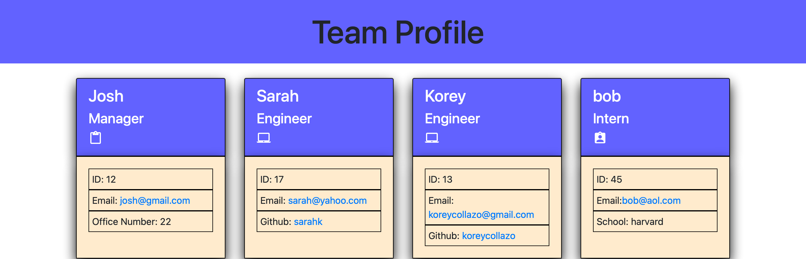

# Team Profile Generator

## Description
The purpose of the Team Profile Generator was to create an application using Node.js and practise object oriented programming to receive data and generate a Html page with the given data. Doing this required the use of inquirer in order to prompt for user  data as well as the use of Jest in order to test the functionality.

## Table of Contents
  - [Installation](#installation)
  - [Usage](#usage)
  - [Credits](#credits)
  - [License](#license)
  
## Installation
After cloning the repository, run "npm i" in an integrated terminal in order to install the dependences. Next enter "node index.html"

## Usage
No specific instructions, just complete the prompted questions and the hmtl page will automatically open in your default browser.

## Credits   

N/A
 
## License
N/A
## Tests

## Questions
For more projects, [KoreyCollazo](#https://github.com/KoreyCollazo).

Koreycollazo@gmail.com
If you have any questions or wish to contact me, please reach out to the provided email.
